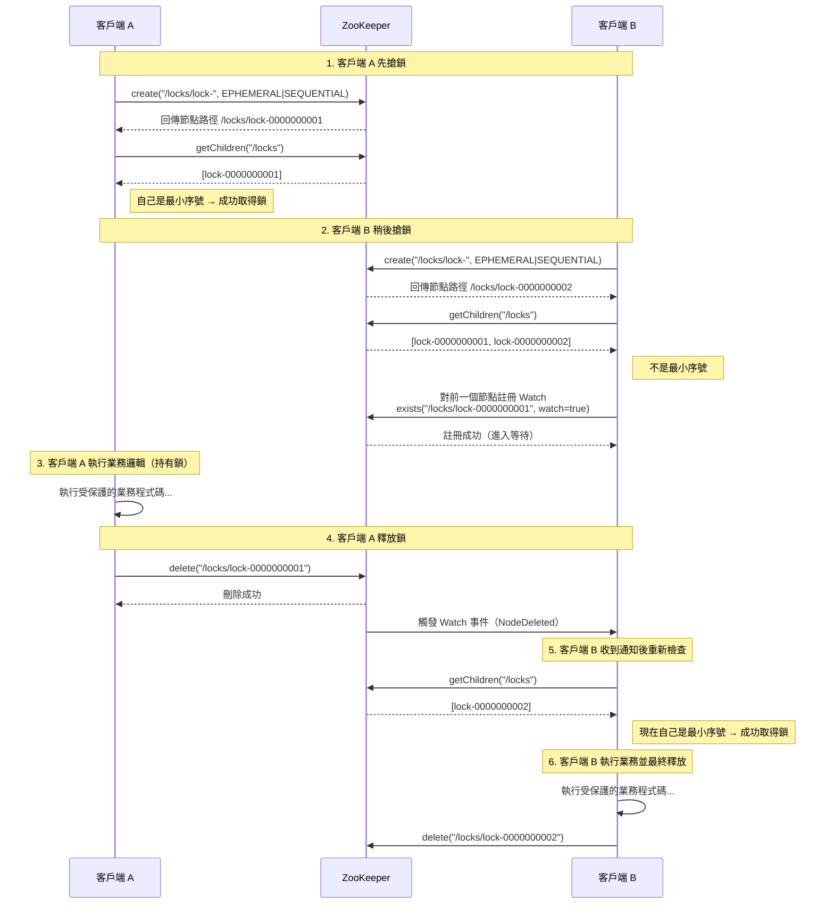

# ZooKeeper 分散式鎖重點筆記

> 整理日期：2026-07-28

> **說明**：本文件包含 Mermaid 時序圖，GitHub 原生支援渲染。

---

## 1. 核心機制

- 使用 **臨時順序節點（Ephemeral Sequential Node）**
- 路徑範例：`/locks/lock-0000000001`
- 最小序號的節點獲得鎖
- 其他節點 Watch 自己的前一個節點（避免羊群效應）

## 2. 加鎖流程（公平鎖）

1. 建立臨時順序節點
2. 取得所有子節點並排序
3. 如果自己是最小序號 → 獲得鎖
4. 否則對前一個節點註冊 Watch，進入等待
5. 收到 NodeDeleted 事件後，重新檢查是否成為最小序號

## 3. 解鎖與故障處理

- 主動刪除自己的節點即可釋放鎖
- 客戶端崩潰 → Session 超時 → 臨時節點自動刪除 → 鎖自動釋放（防死鎖）

## 4. ZooKeeper 分散式鎖時序圖

## 5. 優點

- 真正的強一致性（CP）
- 天然支援公平鎖與可重入（Curator 的 `InterProcessMutex`）
- 自動釋放，安全性高

## 6. 缺點

- 效能較 Redis 低
- 運維成本較高
- 寫入壓力大時容易成為瓶頸

## 7. 適用場景

- 對正確性要求極高的場景（金融、核心資源協調、主從選舉）
- 已經存在 ZooKeeper 叢集的系統
