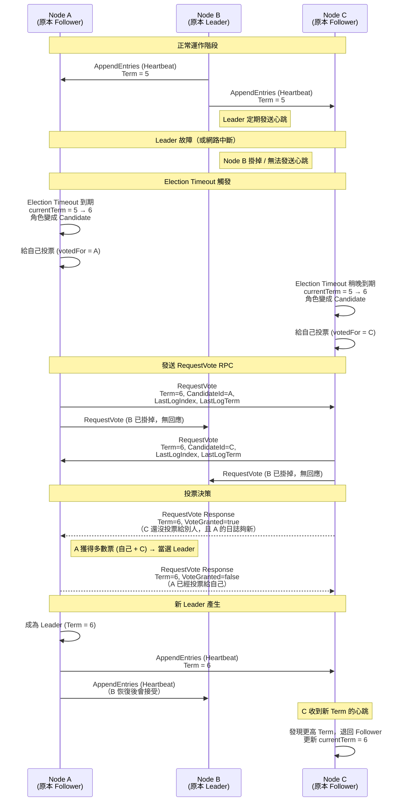

# etcd 分散式鎖與 Raft 演算法重點筆記

> 整理日期：2026-07-28

> **說明**：本文件包含 Mermaid 時序圖，GitHub 原生支援渲染。

---

## 一、etcd 分散式鎖

### 1.1 核心機制

- 使用 **Lease（租約）** + **Txn（交易）** 或官方 concurrency 套件
- 透過 Compare-And-Swap 保證原子性
- 客戶端需定期 KeepAlive 續租

### 1.2 特點

- 基於 **Raft** 共識演算法，強一致性
- API 現代化（gRPC + HTTP/JSON）
- 與 Kubernetes 深度整合
- Watch 機制強大（支援 Revision）

### 1.3 與 ZooKeeper 的主要差異

| 項目           | ZooKeeper              | etcd                     |
|----------------|------------------------|--------------------------|
| 共識演算法     | ZAB                    | **Raft**                 |
| 臨時機制       | Ephemeral Node         | Lease                    |
| 資料模型       | 樹狀 ZNode             | 扁平 KV + Revision       |
| 語言           | Java                   | Go                       |
| 生態重心       | 傳統大數據             | 雲原生 / Kubernetes      |
| 運維友好度     | 較低                   | 較高                     |

### 1.4 適用場景

- Kubernetes 環境
- 新啟動的雲原生微服務專案
- 希望 API 現代、多語言支援佳的系統

---

## 二、Raft 演算法核心重點

Raft 把共識問題拆成三個子問題：Leader Election、Log Replication、Safety。

### 2.1 角色

- **Leader**：處理所有寫入、複製日誌
- **Follower**：被動接收
- **Candidate**：發起選舉

### 2.2 Leader Election（領導者選舉）

1. Follower 超過 Election Timeout 沒收到心跳 → 轉為 Candidate
2. `currentTerm + 1`，給自己投票
3. 發送 RequestVote RPC
4. 獲得多數派選票 → 成為 Leader
5. 立刻發送心跳宣告

**關鍵設計**：隨機 Election Timeout，大幅降低 Split Vote 機率。

### 2.3 Raft 領導者選舉時序圖

### 2.4 Log Replication（日誌複製）

1. Leader 收到寫入請求，先寫入本地日誌
2. 並行發送 AppendEntries 給 Followers
3. 多數派寫入成功後，Leader 提交（Commit）
4. 後續心跳通知 Followers 也提交
5. 狀態機依序執行已提交日誌

### 2.5 Safety 保證

- Election Restriction（只有日誌夠新的節點能當選）
- Log Matching Property
- Leader Completeness
- State Machine Safety

→ 共同保證**線性一致性**。
