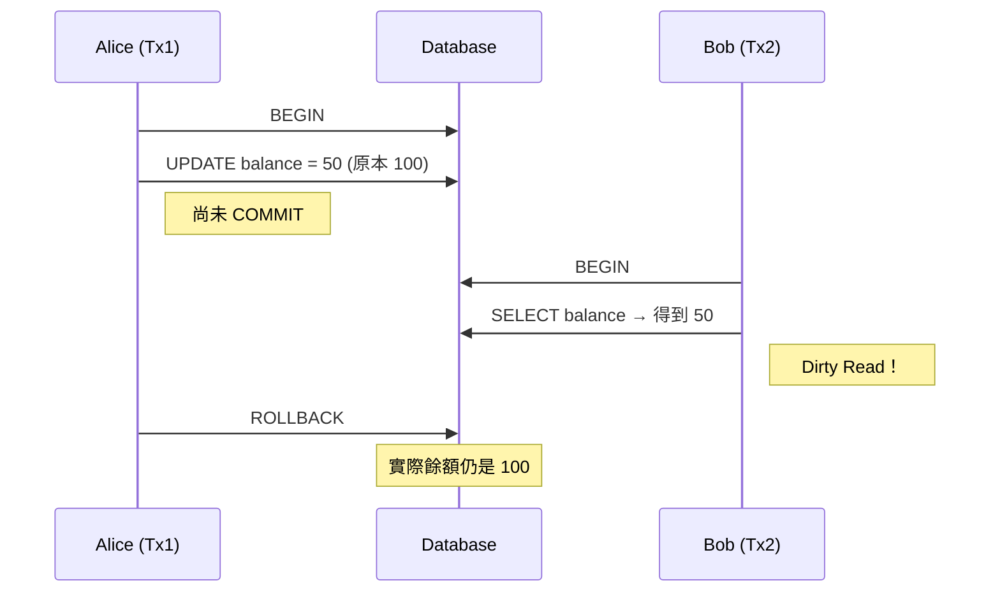
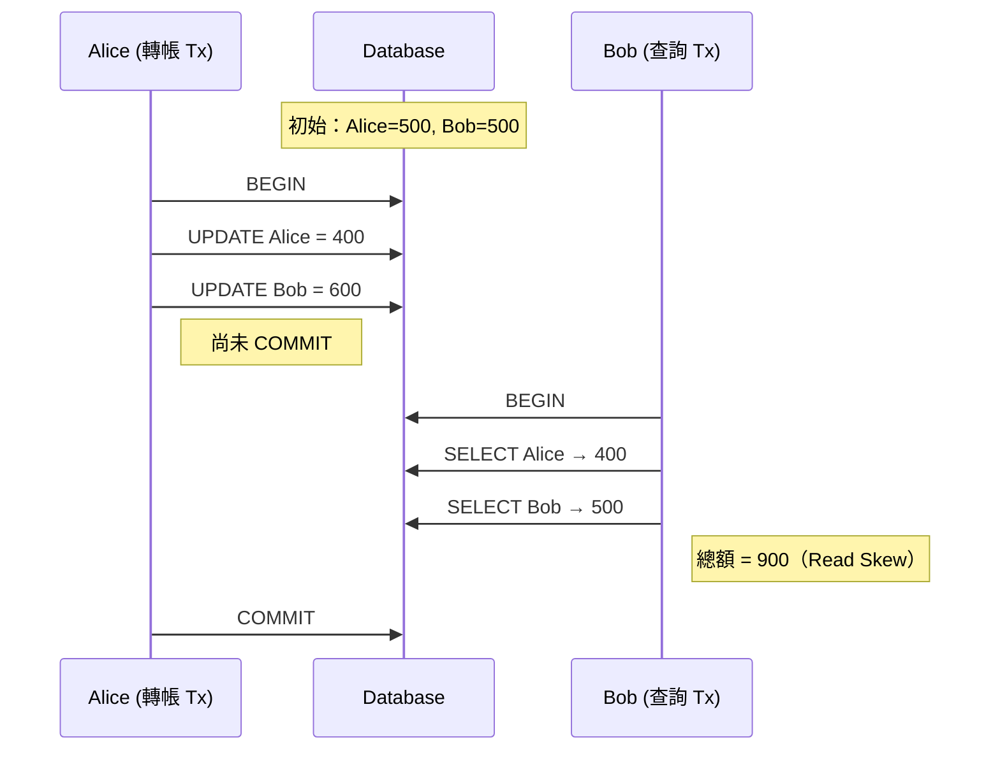
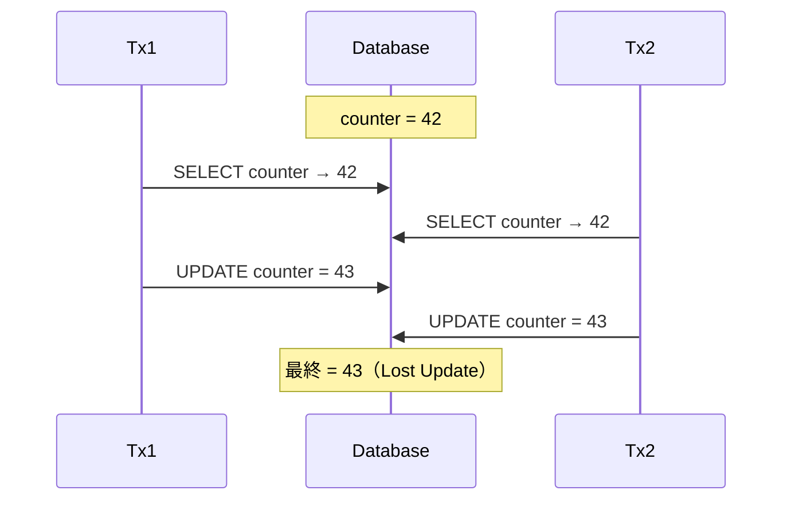
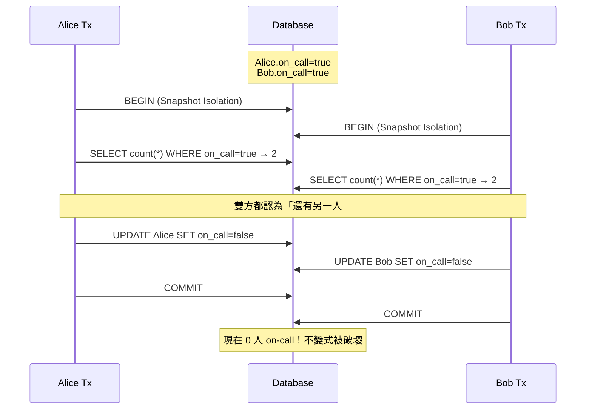

# Transactions 隔離層級與併發異常重點筆記（DDIA Ch.7）

> 整理日期：2026-07-28  
> 來源：*Designing Data-Intensive Applications* Chapter 7  
> **說明**：本文件包含 Mermaid 時序圖，GitHub 原生支援渲染。

---

## 1. 為什麼需要事務？ACID 簡述

在多用戶、高併發環境下，資料庫必須處理同時發生的讀寫，否則會出現各種不一致與資料損壞。

**ACID** 是傳統資料庫對事務的保證：

| 屬性 | 含義 | 說明 |
|------|------|------|
| **Atomicity** | 原子性 | 事務內的所有操作要麼全部成功，要麼全部失敗（回滾）。中間狀態不可見。 |
| **Consistency** | 一致性 | 應用層定義的不變式（invariants）必須在事務結束後成立。資料庫本身只提供工具，真正的一致性多半由應用邏輯保證。 |
| **Isolation** | 隔離性 | 併發事務互不干擾，結果如同串行執行。實際中是**程度問題**，有多種隔離層級。 |
| **Durability** | 持久性 | 一旦 commit，資料即使發生 crash 也不會遺失（寫入 WAL / 磁碟）。 |

本章核心是 **Isolation**——如何在效能與正確性之間取捨。

> **關鍵洞察**：真正的 Serializable Isolation 成本很高，因此絕大多數系統預設使用較弱的隔離層級，把部分併發問題留給應用開發者處理。

---

## 2. 常見併發異常（Anomalies）

以下異常依嚴重程度與常見程度排列。每個異常都會用具體例子說明，並附時序圖。

### 2.1 Dirty Read（髒讀）

**定義**：一個事務讀到了另一個尚未 commit 的寫入。

**問題**：如果寫入事務後來 rollback，讀到的資料就變成「從未存在過」。

**例子**：Alice 把帳戶餘額從 100 改成 50（尚未 commit），Bob 此時讀到 50，之後 Alice 決定 rollback。Bob 看到的是虛假資料。



**防止方式**：Read Committed 及以上層級。

---

### 2.2 Dirty Write（髒寫）

**定義**：一個事務覆寫了另一個尚未 commit 的寫入。

**問題**：如果第一個事務後來 rollback，第二個事務的寫入可能會被意外清除，或造成業務邏輯混亂。

**幾乎所有現代資料庫都會防止 Dirty Write**（通常透過 row-level exclusive lock）。

---

### 2.3 Non-repeatable Read / Read Skew（不可重複讀 / 讀取偏斜）

**定義**：同一個事務內，兩次讀取同一筆資料得到不同結果（因為中間有其他事務 commit 了更新）。

**Read Skew** 更廣義：一個事務看到的資料集合在時間上不一致（例如看總額時，看到一半更新後的狀態）。

**經典例子（銀行轉帳）**：

Alice 帳戶 500，Bob 帳戶 500，總額應為 1000。  
Alice 正在把 100 轉給 Bob。Bob 同時查詢總額：

- 先讀到 Alice 的 400（已更新）
- 再讀到 Bob 的 500（尚未更新）
- 總額變成 900 → 短暫的不一致



**防止方式**：Snapshot Isolation 或更強層級（事務從頭到尾看到同一個快照）。

---

### 2.4 Lost Update（更新遺失）

**定義**：兩個事務都讀取同一個值，各自計算新值後寫回，後寫者覆蓋前寫者，導致其中一次更新「消失」。

**例子**：

```text
初始 counter = 42

Tx1: read 42 → 計算 42 + 1 = 43 → write 43
Tx2: read 42 → 計算 42 + 1 = 43 → write 43

最終結果 = 43，而不是預期的 44
```

**常見於**：計數器、庫存扣減、版本號更新等 read-modify-write 模式。

**防止方式**：
- 原子操作（`UPDATE ... SET counter = counter + 1`）
- Explicit locking（`SELECT ... FOR UPDATE`）
- Automatic lost-update detection（部分 Snapshot Isolation 實作會偵測並 abort）
- Compare-and-set / 樂觀鎖（version 欄位）



---

### 2.5 Write Skew（寫入偏斜）

**定義**：兩個事務讀取一組重疊的物件，然後各自寫入**不同**的物件，最終導致應用層不變式被破壞。

這是 Snapshot Isolation 最容易忽略、也最危險的異常。

**經典例子（醫院值班醫生）**：

系統要求「任何時間至少要有一位醫生 on-call」。

目前 Alice 和 Bob 都在 on-call。兩人幾乎同時決定下線：

1. 各自讀取目前 on-call 人數 = 2
2. 判斷「還有另一人，我可以下線」
3. 各自把**自己**的狀態改成 off-call
4. 兩個事務都成功 commit → 現在 0 人 on-call



**為什麼 Snapshot Isolation 擋不住？**  
因為兩個事務寫的是**不同的 row**，沒有發生寫寫衝突，MVCC 認為沒問題。

**防止方式**：
- 真正的 Serializable Isolation（2PL 或 SSI）
- 應用層顯式鎖定相關 row（`SELECT ... WHERE on_call=true FOR UPDATE`）
- 把不變式物化成單一 row（例如用計數器 + 原子操作）

---

### 2.6 Phantom Reads（幻讀）

**定義**：同一個事務內，兩次執行相同的範圍查詢，第二次看到了新插入（或刪除）的 row。

與 Write Skew 密切相關——當寫入是「插入符合某條件的新資料」時，就可能產生 Phantom。

**防止方式**：Serializable Isolation（需要 predicate lock 或 index-range lock），或在應用層物化衝突。

---

## 3. 隔離層級對照

| 隔離層級              | 防止 Dirty Read | 防止 Dirty Write | 防止 Non-repeatable Read / Read Skew | 防止 Lost Update | 防止 Write Skew | 防止 Phantom | 典型實作                     | 常見預設資料庫 |
|-----------------------|-----------------|------------------|--------------------------------------|------------------|-----------------|--------------|------------------------------|----------------|
| **Read Uncommitted**  | ❌              | 通常有           | ❌                                   | ❌               | ❌              | ❌           | 幾乎不用                     | -              |
| **Read Committed**    | ✅              | ✅               | ❌                                   | ❌               | ❌              | ❌           | 行鎖 + 讀最新已提交版本      | PostgreSQL、Oracle、SQL Server 預設 |
| **Repeatable Read**   | ✅              | ✅               | ✅                                   | 部分             | ❌              | 部分         | 名稱混亂（見下方）           | MySQL InnoDB（實際接近 SI） |
| **Snapshot Isolation**| ✅              | ✅               | ✅                                   | 多數實作會偵測   | ❌              | 部分         | **MVCC**                     | PostgreSQL (RR)、Oracle、SQL Server Snapshot |
| **Serializable**      | ✅              | ✅               | ✅                                   | ✅               | ✅              | ✅           | 2PL / SSI / 真正串行         | PostgreSQL (Serializable)、部分 NewSQL |

> **重要澄清**：  
> - ANSI SQL 的「Repeatable Read」定義很模糊。  
> - PostgreSQL 的 `REPEATABLE READ` 實際上是 Snapshot Isolation。  
> - MySQL InnoDB 的 `REPEATABLE READ` 也接近 Snapshot Isolation，並用 gap lock 部分防止 phantom。  
> - 真正能防止 Write Skew 的只有 **Serializable**。

---

## 4. 核心實作機制

### 4.1 Two-Phase Locking（2PL）

- **成長階段**：取得需要的鎖（shared / exclusive）
- **收縮階段**：釋放所有鎖（通常在 commit/abort 時）
- 讀寫都會互相阻塞 → 容易死鎖、吞吐下降
- 傳統 Serializable 的實作方式

### 4.2 Multi-Version Concurrency Control（MVCC）

- 每個寫入產生新版本，舊版本保留一段時間
- 讀取事務根據自己的 snapshot timestamp 選擇可見版本
- **Readers never block writers, writers never block readers**
- Snapshot Isolation 的基礎
- PostgreSQL、Oracle、MySQL InnoDB、SQL Server 都使用

### 4.3 Serializable Snapshot Isolation（SSI）

SSI = **Snapshot Isolation + 執行時偵測 rw-衝突（anti-dependencies）**。

核心觀察（Cahill et al. 2008）：Snapshot Isolation 下所有序列化異常，都對應到 dependency graph 中的一個「危險結構」（dangerous structure）：

```text
Tin  --rw-->  Tpivot  --rw-->  Tout
```

只要偵測並打破這種「兩個相鄰的 rw-衝突」，就能保證可序列化（可能有少數 false positive）。

PostgreSQL 從 9.1 起，`SERIALIZABLE` 就是用 SSI 實作（`REPEATABLE READ` 仍是普通 SI）。

#### 4.3.1 什麼是 rw-衝突（rw-antidependency）？

- 事務 T1 **讀取**了某個物件的某個版本
- 事務 T2（與 T1 併發）**寫入**了同一個物件的更新版本
- 則產生 T1 --rw--> T2（T1 在序列順序上應出現在 T2 **之前**，因為 T1 沒看到 T2 的寫入）

SSI **只追蹤 rw-衝突**，不需要完整追蹤 wr / ww 依賴（因為 SI 本身已經處理了大部分寫寫衝突）。

#### 4.3.2 兩種偵測 rw-衝突的方式

##### 1. Detecting stale MVCC reads（偵測過期的 MVCC 讀取）

當「寫入發生在讀取之前，或讀取時已經能看到更新版本的痕跡」時使用。

- 事務在讀取 tuple 時，會依 MVCC 規則檢查 `xmin` / `xmax`
- 如果發現：
  - 這個版本是由一個**併發事務**寫入的（但對自己的 snapshot 還不可見），或
  - 這個版本已被一個併發事務刪除／更新（`xmax` 指向併發事務，但刪除對自己 snapshot 還不可見）
- 則判定為 **stale read** → 產生 rw-衝突：讀取者 --rw--> 寫入者

這部分可以直接利用既有的 MVCC 可見性檢查，幾乎零額外成本。

##### 2. Detecting writes that affect prior reads（偵測影響先前讀取的寫入）

當「讀取發生在寫入之前」時使用。

- 每個 Serializable 事務在**讀取**資料時，會在讀到的物件上取得 **SIREAD lock**（也稱為 predicate lock）
  - SIREAD lock **不會阻塞任何人**（真正的 non-blocking）
  - 可以加在 tuple、page 或整個 relation 層級（記憶體不足時會向上聚合）
- 當事務要**寫入**（INSERT / UPDATE / DELETE）時，檢查目標物件上是否已有其他併發事務的 SIREAD lock
- 如果有 → 產生 rw-衝突：先前的讀取者 --rw--> 目前的寫入者

這解決了「讀完之後別人才寫」的情況（經典 Write Skew 就是這種）。

#### 4.3.3 危險結構的判斷與 abort

每個事務會記錄自己是否有：

- **in-conflict**（有其他事務對我產生 rw-衝突，即有人讀了我寫的資料）
- **out-conflict**（我對其他事務產生 rw-衝突，即我讀了別人寫的資料）

當一個事務同時具備 in-conflict 與 out-conflict（它成為 Tpivot），且符合 commit 順序條件時，系統會 abort 其中一個事務（通常採「first-committer-wins」風格，確保被 abort 的事務重試時不會再跟已 commit 的事務衝突）。

應用層會收到類似錯誤：

```text
ERROR: could not serialize access due to read/write dependencies among transactions
```

必須像樂觀鎖一樣**重試整個事務**。

#### 4.3.4 SSI 的優點與代價

| 項目 | 說明 |
|------|------|
| 優點 | 讀不阻塞寫、寫不阻塞讀；效能接近普通 Snapshot Isolation；真正可序列化 |
| 代價 | 需要維護 SIREAD lock；可能有 false positive（記憶體壓力導致 lock 升級到 page/relation 時更明顯） |
| 實務 | 應用必須準備好處理 serialization failure 並重試 |

> **與 2PL 的對比**：2PL 用真實的共享/排他鎖來*預防*衝突；SSI 用非阻塞的 SIREAD lock + 衝突偵測來*發現*可能的異常後再 abort。因此 SSI 在讀多寫少或衝突不密集的場景通常有更好的吞吐量。

### 4.4 真正的串行執行

- 所有事務在單一執行緒（或單一 partition）上依序執行
- VoltDB、Redis（單執行緒）、Datomic 等採用
- 適合事務短小、資料可放進記憶體的場景

---

## 5. 實務建議與選型

| 場景 | 建議隔離層級 | 理由 |
|------|--------------|------|
| 一般 Web 應用、CRUD | Read Committed | 效能最好，大多數異常可由應用層處理 |
| 報表、備份、長時間分析查詢 | Snapshot Isolation | 需要一致的快照，避免 Read Skew |
| 庫存扣減、計數器、餘額變更 | 原子操作 or 樂觀鎖 + 重試 | 即使在 SI 下也要小心 Lost Update |
| 有複雜不變式（至少一人值班、唯一性約束等） | Serializable 或顯式鎖定 | Write Skew 是隱形殺手 |
| 金融核心、帳務系統 | Serializable + 充分測試 | 正確性優先於效能 |

**應用層常見應對策略**（詳細實作見後續筆記）：

1. **樂觀鎖**（Version 欄位 + 重試）→ 見 [02-Pessimistic-and-Optimistic-Locking.md](./02-Pessimistic-and-Optimistic-Locking.md)
2. **悲觀鎖**（`SELECT ... FOR UPDATE` / `FOR SHARE`）→ 見同上
3. **原子操作**：能用 `UPDATE ... SET x = x + 1` 就不要用 read-modify-write
4. **物化衝突**：把「至少一人 on-call」改成單一計數器 row → 見 02 筆記
5. **死鎖處理**：統一鎖順序 + 應用層重試 → 見 [03-Deadlocks.md](./03-Deadlocks.md)

---

## 6. 與分散式系統的連結

本章討論的是**單一資料庫節點**內的事務隔離。

進入分散式環境後：

- **Atomicity** 跨多個節點變得困難 → 需要 2PC、Saga、TCC 等協議
- **Isolation** 更難保證 → 分散式事務通常只能提供較弱的隔離，或改用最終一致性 + 補償
- 許多分散式系統乾脆放棄跨服務的 ACID，改用「本地事務 + 訊息驅動的最終一致性」

後續筆記會接續討論：

- 兩階段提交（2PC）與其阻塞問題
- TCC（Try-Confirm-Cancel）
- Saga 模式（編排 vs 編排）
- 為什麼多數微服務寧願用最終一致性

---

## 7. 快速複習清單

- [ ] 能清楚解釋 Dirty Read / Lost Update / Write Skew 的差別
- [ ] 知道 Snapshot Isolation 擋不住 Write Skew
- [ ] 知道 PostgreSQL 的 `REPEATABLE READ` 其實是 SI
- [ ] 能說出至少三種防止 Lost Update 的方法
- [ ] 能畫出醫生值班的 Write Skew 時序圖
- [ ] 知道 SSI 是目前較實用的 Serializable 實作
- [ ] 能說明 SSI 如何用「stale MVCC reads」與「SIREAD lock」偵測 rw-衝突
- [ ] 知道危險結構（Tin --rw--> Tpivot --rw--> Tout）的意義
- [ ] 能區分悲觀鎖與樂觀鎖，並知道各自適用場景（見 02 筆記）
- [ ] 知道死鎖的常見原因與預防方法（見 03 筆記）

---

整理完成後可直接用於面試複習與實務決策。
