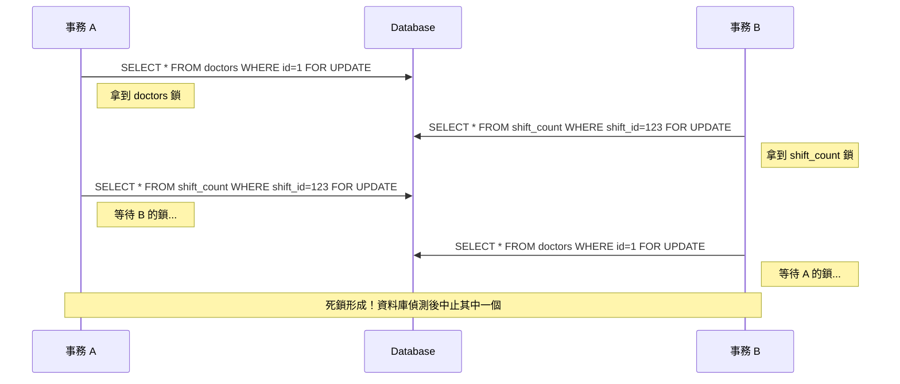

# 死鎖（Deadlock）重點筆記

> 整理日期：2026-07-28  
> 來源：*Designing Data-Intensive Applications* Chapter 7 + 實務補充  
> **說明**：本文件包含 Mermaid 時序圖，GitHub 原生支援渲染。

---

## 1. 什麼是死鎖？

兩個（或多個）事務互相持有對方需要的鎖，導致大家都在等待，永遠無法繼續執行。

最經典情況：

```text
事務 A：鎖住了 Row X，正在等 Row Y
事務 B：鎖住了 Row Y，正在等 Row X
→ 形成環形等待（Circular Wait）→ 死鎖
```

---

## 2. 死鎖發生的常見原因

| 原因 | 說明 | 實際例子 |
|------|------|----------|
| **鎖的順序不一致** | 不同事務以不同順序去鎖多筆資料 | A 先鎖 doctors 再鎖 shift_count；B 相反 |
| **一次鎖多筆資料** | `SELECT ... FOR UPDATE` 鎖多筆 row | 一次選出多筆庫存或關聯資料 |
| **外鍵 / 索引鎖** | 更新子表時隱性鎖住父表 | 更新訂單明細時鎖住訂單主檔 |
| **長時間持鎖** | 事務開太久，中間還做其他事情 | 先 `FOR UPDATE`，再呼叫外部 API |
| **鎖升級或間隙鎖** | MySQL Gap Lock / Next-Key Lock | 範圍查詢 + 插入造成鎖範圍重疊 |

---

## 3. 資料庫如何處理死鎖？

現代資料庫（PostgreSQL、MySQL InnoDB、SQL Server、Oracle）都有**死鎖偵測器**：

1. 定期檢查鎖等待圖（Wait-for Graph）是否有環
2. 發現環後，選擇一個「犧牲者」（Victim）事務，把它 **ROLLBACK**
3. 回傳錯誤給應用（PostgreSQL：`40P01 deadlock_detected`；MySQL：`1213 Deadlock found`）

**重要**：資料庫只負責「偵測 + 中止其中一個」，**不會自動幫你重試**。重試責任在應用層。

---

## 4. 經典死鎖時序圖（鎖順序不一致）



---

## 5. 解法與最佳實踐

### 5.1 預防死鎖（最根本）

1. **統一鎖的順序**（最有效）
   - 所有事務都按照相同順序鎖資源（例如永遠先鎖 id 較小的 row，或先鎖主表再鎖子表）。
   - 範例：永遠先鎖 `shift_on_call_count`，再鎖 `doctors`。

2. **縮短事務時間**
   - 只做必要的資料庫操作。
   - 不要在事務中呼叫外部 API、發送郵件、做複雜計算。

3. **能不加鎖就不要加**
   - 普通查詢不要隨便加 `FOR UPDATE`。
   - 能用樂觀鎖就優先用。

4. **一次只鎖必要的資料**
   - 避免 `SELECT * FROM table FOR UPDATE` 鎖大量 row。

### 5.2 發生死鎖後的處理（應用層必須做）

```python
# 標準重試模式
for attempt in range(3):  # 最多重試 2~3 次
    try:
        with db.transaction():
            # 業務邏輯（含 SELECT FOR UPDATE）
            ...
        break  # 成功就跳出
    except DeadlockError:
        if attempt == 2:
            raise  # 最後一次還失敗就往上拋
        time.sleep(0.05 * (2 ** attempt))  # 指數退避
        continue
```

**重點**：
- 一定要捕捉死鎖錯誤並重試
- 重試次數通常 2~3 次就夠
- 建議加指數退避，避免活鎖（Livelock）

### 5.3 其他輔助手段

| 方法 | 說明 | 適用情況 |
|------|------|----------|
| 設定 `lock_timeout` | 超過時間就放棄等待 | 避免長時間卡住 |
| 降低隔離層級 | 用 Read Committed 減少鎖競爭 | 可接受較弱一致性時 |
| 樂觀鎖取代悲觀鎖 | 用 version 欄位 + 重試 | 衝突率不高的場景 |
| 拆分熱點資料 | 把高競爭的 row 拆開 | 熱點計數器、庫存 |

---

## 6. 與樂觀鎖 / 悲觀鎖的關係

- **悲觀鎖**（`SELECT FOR UPDATE`）是死鎖的主要來源之一。
- **樂觀鎖**幾乎不會產生死鎖（因為不持有鎖等待）。
- 高衝突場景如果改用樂觀鎖，可大幅降低死鎖機率，但要付出重試成本。

---

## 7. 快速複習清單

- [ ] 能畫出經典的環形等待死鎖時序圖
- [ ] 知道資料庫偵測到死鎖後會做什麼
- [ ] 能說出至少三種預防死鎖的方法
- [ ] 知道應用層必須自己做死鎖重試
- [ ] 了解統一鎖順序是最有效的預防手段

---

整理完成後可直接用於面試複習與實務決策。
